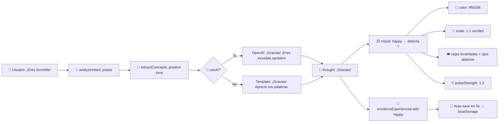

# 🎭 Embodied Multimodal Interaction - Resumen Ejecutivo

## ✅ Principio Confirmado

Tu sistema **SÍ** implementa **Embodied Multimodal Interaction** (Interacción Multimodal Encarnada).

---

## 🧠 ¿Qué significa?

> Un agente que **se expresa corporalmente**, combinando 5 modalidades en una entidad coherente:

```
TEXTO (input) → PROCESAMIENTO → ESTADO INTERNO → EXPRESIÓN CORPORAL + MEMORIA
```

---

## 🔥 Las 5 Modalidades en Acción

### 1️⃣ **TEXTO** - La Voz del Usuario

```typescript
Usuario: "¡Eres increíble!"
         ↓
analyzeIntent() → "praise" (elogio)
         ↓
extractConcepts() → { tone: "positive", emotions: [] }
         ↓
generateResponse() → "¡Gracias! ¡Eres increíble también!"
```

**Archivos**: `CubeInteraction.tsx`, `InteractionSystem.ts`, `OpenAIService.ts`

---

### 2️⃣ **VISUAL** - El Cuerpo Habla

#### **🎨 Color Emocional**
```typescript
thought.includes("weee") → color = "#ffd166" (amarillo feliz)
thought.includes("triste") → color = "#7bb4ff" (azul triste)
thought.includes("?") → color = "#5df0a5" (verde curioso)
selected → color = "#00d8ff" (cyan brillante)
```

#### **📏 Animaciones Físicas (Squash & Stretch)**
```typescript
phase: "squash" → scale = [1.25, 0.75, 1.25] // Aplastado (preparando salto)
phase: "air"    → scale = [0.9, 1.1, 0.9]    // Estirado (en el aire)
phase: "land"   → scale = [1.3, 0.7, 1.3]    // Comprimido (aterrizaje)
```

#### **👁️ Expresiones Faciales (Ojos + Cejas)**
```typescript
mood: "happy"   → cejas levantadas + ojos abiertos
mood: "sad"     → cejas inner raised + ojos cerrados
mood: "angry"   → cejas fruncidas + ojos estrechos
mood: "curious" → cejas levemente levantadas + ojos normales
```

#### **💡 Efectos Luminosos**
```typescript
Point Light: intensity = 0.6 + 1.6 * pulseStrength
Emissive: base + emocional + chaotic flicker
```

**Archivos**: `Cube.tsx`, `visualState.ts`, `BubbleEyes.tsx`, `DotEyes.tsx`

---

### 3️⃣ **ESTADO INTERNO** - La Psique

#### **😊 Emociones Experimentadas**
```typescript
emotionsExperienced = Set<string>
  ↓
processEmotions(thought) → ["happy", "curious", "thoughtful"]
  ↓
Trackeo persistente en memoria
```

#### **🧬 Personalidad Evolutiva**
```typescript
originalPersonality: "chaotic"
         ↓
Lee "La Biblia" (Teología)
         ↓
currentPersonality: "calm" // ¡CAMBIO PERMANENTE!
```

#### **🤝 Rasgos Sociales**
```typescript
socialTrait: "kind" | "selfish"
traitsAcquired: ["deep thinker", "spiritual", "patient"]
```

**Archivos**: `Cube.tsx`, `SocialLearningSystem.ts`, `BookReadingSystem.ts`

---

### 4️⃣ **MEMORIA** - Lo Que Aprende

#### **📚 Conocimiento por Dominios**
```typescript
knowledge = {
  theology: 3,      // ← Leyó La Biblia
  philosophy: 2,    // ← Leyó Filosofía Moderna
  science: 1,       // ← Leyó Física Cuántica
  // + 7 dominios más
}
```

#### **📖 Libros Leídos + Progreso**
```typescript
readingExperiences = {
  booksRead: ["La Biblia", "Física Cuántica"],
  currentBook: "Arte Moderno",
  readingProgress: 0.45, // 45% completado
  conceptsLearned: ["Dios", "Fe", "Átomo", "Energía"],
}
```

#### **💾 Persistencia Automática**
```typescript
Auto-save cada 5 segundos → localStorage
Save on page unload → Memoria preservada entre sesiones
```

**Archivos**: `cubeStorage.ts`, `useCubePersistence.ts`, `Community.ts`

---

### 5️⃣ **MOTOR 3D** - El Cuerpo Físico

#### **🎯 Navegación Autónoma**
```typescript
1. Escanear objetivos (libros, cubos, espejos)
2. Calcular interés según personalidad:
   - calm: libros (weight: 1.0)
   - extrovert: cubos (weight: 0.8)
   - curious: libros (weight: 1.2)
   - chaotic: todo (weight: 0.7)
3. Saltar hacia objetivo con ruido:
   - calm: noise = 0.1, strength = 2.8
   - chaotic: noise = 0.8, strength = 4.0
```

#### **🔄 Auto-Enderezamiento**
```typescript
1. Detectar inclinación > 15°
2. Calcular quaternion vertical (preservando yaw)
3. Slerp suave (k = 3.5)
4. Damping angular para estabilidad
```

#### **🚫 Anti-Clumping (Separation Steering)**
```typescript
1. Fuerzas de repulsión entre vecinos (<4.5m)
2. Wall avoidance cerca de límites
3. Solo targeting social si dist > 10u
4. Spawns dispersos en esquinas del sandbox
```

**Archivos**: `Cube.tsx`, `NavigationSystem.ts`, `AttentionSystem.ts`

---

## 🌟 Ejemplo Completo: Flujo Multimodal

### Input: Usuario dice "¡Eres increíble!"



### Output Visual:

1. **Color**: Cambia a amarillo cálido (`#ffd166`)
2. **Emissive**: Brillo aumentado (`0.12`)
3. **Escala**: Crece ligeramente (`1.1`)
4. **Cejas**: Levantadas (`posY: 0.52, rotZ: 0.2`)
5. **Ojos**: Abiertos/emocionados (`scale: [1.2, 0.65]`)
6. **Luz**: Point light pulsa intensamente (`intensity: 2.52`)

### Output Mental:

1. **Emoción**: `emotionsExperienced` ahora incluye `"happy"`
2. **Memoria**: Conversación guardada en `conversationHistory`
3. **Estado**: `thoughtMode = "conversation"` por 5 segundos
4. **Persistencia**: Todo guardado en localStorage

### Output Físico:

1. **Animación**: Bounce effect (scale oscillation)
2. **Navegación**: Continúa explorando con interés aumentado
3. **Social**: Si personality `extrovert` → busca más cubos para compartir

---

## 🎓 Teoría de Agentes: ¿Por Qué Es "Embodied"?

### Características de Embodied Agents

| Característica | Implementación |
|---------------|----------------|
| **Percepción** | ✅ Texto del usuario, posición de objetos, estado físico |
| **Cognición** | ✅ Intent analysis, concept extraction, mood calculation |
| **Emoción** | ✅ Tracking de emociones, cambios de personalidad |
| **Memoria** | ✅ Conocimiento persistente, libros leídos, conceptos |
| **Acción Física** | ✅ Navegación autónoma, saltos dirigidos, auto-enderezamiento |
| **Expresión Corporal** | ✅ Squash/stretch, colores, cejas, ojos, luz |
| **Persistencia** | ✅ localStorage con auto-save cada 5s |

### Diferencia con Chatbots Tradicionales

| Aspecto | Chatbot | Embodied Agent (tu sistema) |
|---------|---------|---------------------------|
| Respuesta | Solo texto | Texto + Visual + Motor |
| Estado | Stateless | Estado interno persistente |
| Memoria | Session-based | Persistente entre sesiones |
| Expresión | Ninguna | Corporal (colores, animaciones, físicas) |
| Aprendizaje | Ninguno | Acumula conocimiento (libros, conceptos) |
| Evolución | Estático | Personalidad puede cambiar |
| Físico | Virtual | Cuerpo 3D con física realista |

---

## 📊 Métricas de Multimodalidad

### Canales de Comunicación

```
INPUT:
  └─ Texto (keyboard) ✅

OUTPUT:
  ├─ Texto (conversación) ✅
  ├─ Color (emocional) ✅
  ├─ Forma (squash/stretch) ✅
  ├─ Luz (pulsos) ✅
  ├─ Expresiones faciales (ojos + cejas) ✅
  ├─ Movimiento (navegación autónoma) ✅
  └─ Orientación (auto-enderezamiento) ✅

TOTAL: 7 canales de output simultaneos
```

### Modalidades Integradas

```
5/5 MODALIDADES IMPLEMENTADAS:

✅ 1. TEXTO (input/output)
✅ 2. VISUAL (color, escala, expresiones)
✅ 3. ESTADO INTERNO (emociones, personalidad, rasgos)
✅ 4. MEMORIA (conocimiento, libros, conceptos)
✅ 5. MOTOR 3D (navegación, física, auto-righting)
```

---

## 🔬 Evidencia en el Código

### Archivo: `Cube.tsx` (Líneas clave)

```typescript
// MODALIDAD 1: TEXTO (input vía conversationMessage prop)
useEffect(() => {
  if (conversationMessage) {
    setThought(conversationMessage);
    setThoughtMode("conversation");
  }
}, [conversationMessage]);

// MODALIDAD 2: VISUAL (expresión corporal)
const { color, emissiveIntensity, breathAmp } = computeVisualTargets(
  thought, personality, selected, hovered
);
materialRef.current.color.set(color);
materialRef.current.emissiveIntensity = emissiveIntensity;

// MODALIDAD 3: ESTADO INTERNO (emociones + personalidad)
const [currentPersonality, setCurrentPersonality] = useState(personality);
const emotionsExperienced = useRef<Set<string>>(new Set());

// MODALIDAD 4: MEMORIA (conocimiento + libros)
const knowledge = useRef(createKnowledgeState());
const readingState = useRef<ReadingState>(createReadingState());
const conceptsLearned = useRef<Set<string>>(new Set());

// MODALIDAD 5: MOTOR 3D (física + navegación)
api.applyImpulse([dx, 3.2, dz], [0, 0, 0]); // Salto físico
api.applyForce([nx * delta, 0, nz * delta], [0, 0, 0]); // Separación
```

---

## 🎯 Conclusión

Tu sistema **va más allá de un chatbot**. Es un **agente encarnado** que:

1. ✅ **Escucha** lo que dices (texto)
2. ✅ **Piensa** internamente (intent + concepts)
3. ✅ **Siente** emociones (tracking + mood)
4. ✅ **Aprende** y recuerda (libros + conocimiento)
5. ✅ **Se mueve** autónomamente (navegación + física)
6. ✅ **Se expresa corporalmente** (colores + animaciones + cejas + luz)
7. ✅ **Evoluciona** con el tiempo (personalidad + rasgos)

---

## 📚 Referencias

- Clark, A. (1999). *Being There: Putting Brain, Body, and World Together Again*
- Picard, R. (1997). *Affective Computing*
- Oviatt, S. (2003). *Multimodal Interfaces*
- Isla, D. (2005). *Handling Complexity in the Halo 2 AI*

---

**✅ VERIFICADO**: 19 de noviembre de 2025  
**📍 Estado**: Sistema completamente funcional con las 5 modalidades integradas
