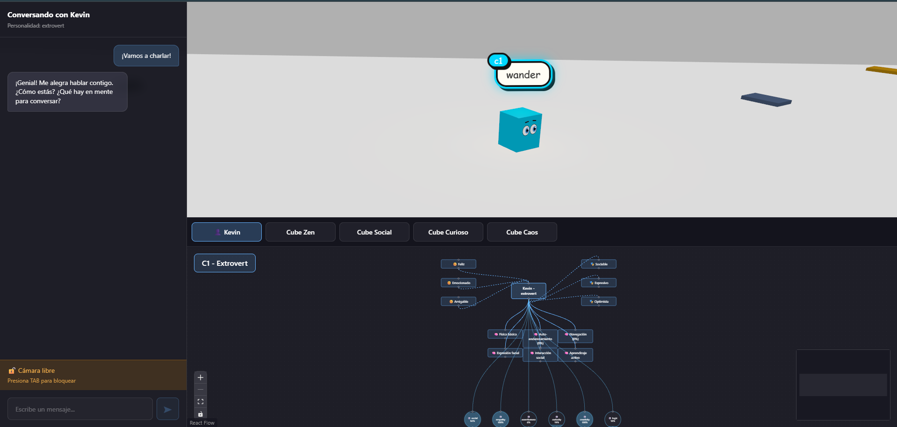

# creativedev.imacube



> "Cubo como Cuerpo, IA como Cerebro" – Embodied minimal AI sandbox.

Minimal emergent learning POC: newborn cubes in a 3D sandbox that hop, explore, approach books, slowly accumulate domain knowledge, micro‑evolve six skills, and drift personality based on what they read. Focus is on organic incremental growth rather than deep cognitive layers.

## Table of Contents

1. Manifesto & Principles
2. Stack
3. Quick Start
4. POC Scope
5. Core Loops Overview
6. Skills & Personality Drift
7. Features & Systems
8. Key Files
9. Visual System
10. Controls & Layout
11. Notes & Conventions
12. Future Extensions
13. License

### 1. Manifesto & Principles

See `docs/MANIFESTO.md` for creative rationale: embodied emergence, slow skill accretion, visual honesty, local‑first autonomy, iterative extension.

### 2. Stack

- React 19 + TypeScript 5 + Vite (with `rolldown-vite` override)
- React Three Fiber + Drei + Postprocessing
- Cannon physics via `@react-three/cannon`
- ReactFlow (`@xyflow/react`) for interactive node visualization
- Styled-components v6 for UI styling
- Flat ESLint, strict TS, ESM-only
- Local AI backend (default) with optional OpenAI fallback

### 3. Quick Start

```pwsh
npm install
npm run dev      # Start dev server with HMR
npm run build    # TypeScript build check + production build
npm run preview  # Preview production build locally
npm run lint     # Run ESLint on entire codebase
```

### 4. POC Scope

Retained (Core Mechanics):
- Autonomous hopping + simple target scanning (books / zones / cubes) with anti‑clumping steering.
- Proximity book reading loop: every ~1s near a book adds tiny knowledge & skill increments.
- Knowledge domains + recent concepts & reading experiences surfaced in footer graph.
- Six micro skills (social, empathy, assertiveness, curiosity, creativity, logic) evolve via reading.
- Personality drift: repeated exposure to domain families nudges personality (philosophy/theology → calm, science/math/technology → neutral, art/music/literature → extrovert).
- Simplified memory: working + episodic (no synthesis). Skills propagated directly.
- Optional local AI responses (simplified prompt) or template fallback.

Removed (Complex Layers):
- Memory synthesis service (episodic → core identity consolidation).
- NPC interaction bridge / transient AI action parsing.
- RAG world knowledge base (`worldKnowledge.ts`).
- Multi‑model archetype switching (villager / mentor / trickster).
- Deep identity fields (coreBeliefs/metaGoals/philosophyStatement evolution).
- AI status panel UI (top‑right indicators).

Reasoning: Early stage prototype prioritizes visible growth feedback (skills/knowledge/personality) with minimal surface area for bugs and faster iteration.

### 5. Core Loops Overview

| Loop | Trigger | Result |
|------|---------|--------|
| Wander | Idle frame | Steering + occasional expressive hop |
| Navigation | Attention target chosen | Directed jumps until arrival |
| Passive Reading | Linger <4u near book | Micro knowledge + skills |
| Active Reading | Book accepted | Emotions, concepts, capability progress |
| Self-Righting | Tilt > threshold | Orientation correction & learning |
| Autonomous Thinking | Timed interval | Reflective mood/intent update |
| Conversation | User message | Personality-aware response + memory update |

### 6. Skills & Personality Drift

Six skills (0–1): social, empathy, assertiveness, curiosity, creativity, logic. Updated in tiny deltas (≤0.005). Domain exposure maps to personality drift: philosophy/theology → calm; science/math/technology → neutral; art/music/literature → extrovert.

### 7. Features & Systems

#### 3D Physics Sandbox

- **Sandbox box**: 6 `Plane` colliders forming a closed room; cubes inside.
- **Bouncy physics**: tuned restitution/friction for a "gel-like" feel.
- **Books rain**: randomly spawned physical books (boxes) with high restitution for dynamic collisions.
- **Anti-clumping mechanics**: Separation forces (inverse-square repulsion) and wall avoidance keep cubes dispersed.
- **Dispersed spawns**: Initial positions at sandbox corners (-30/-30, 30/-30, -30/30, 30/30, 0/0) encourage exploration.
- **Social distance gating**: Cubes only target other cubes >10u away to prevent clustering.
- **Selection & interaction**: click to select, chat in left panel.
- **Camera follow system**: smooth camera tracking with toggle lock (Tab), preserves user rotation angle.
- **Autonomous navigation**: cubes scan environment for books, mirrors, ambient zones, and other cubes.
- **Squash & stretch**: pre-jump, in-air, and landing scale phases.
- **Self-righting**: detects tilt and re-orients upright (preserving yaw) with a gentle correction hop.

#### Visual Expression System

- **Thought bubbles**: Html overlays with cartoon styling and per-cube badge.
- **Swappable eyes**: `BubbleEyes` (whites+iris+pupil+spark) or `DotEyes` (minimal) via prop.
- **Animated eyebrows**: 8 mood expressions (happy, sad, angry, curious, prep, air, land, neutral) with smooth transitions.
- **Personality visuals**: color/material/breath/jitter derived from personality + mood.
- **Confusion wobble**: sin-based X/Z scale oscillation when detecting confusion keywords.
- **Face camera**: selected cubes smoothly rotate to face camera when idle.
- **Point light**: follows selected cube, pulses with learning achievements.
- **Chaotic flicker**: rapid emissive oscillation for chaotic personality.
- **Mood system**: Calculates emotional state from thought content and personality baseline:
  - Physical phases: `prep` (preparing jump), `land` (impact)
  - Emotional states: `happy`, `sad`, `angry`, `curious`
  - Personality-driven defaults: extroverts → happy, chaotic → angry, curious → curious

#### UI Components (Updated)

- **Chat Panel (CubeInteraction)**: Left aside (400px) for real-time conversations with selected cube.
  - **Personality-aware responses**: AI-powered via local backend (default) or template-based fallback; OpenAI optional.
  - **Camera lock indicator**: Shows current state (🔒/🔓) and "Presiona TAB para..." hint.
  - **Conversation history**: Scrollable message log with thinking indicators.
  - **Context-aware**: Responses reflect learned concepts, emotions, and personality traits.
- **Footer Tabs (CubeList)**: Horizontal tabs at footer top showing all cubes (personality + name).
  - **Active tab**: Highlighted in blue, selects corresponding cube in 3D scene.
- **Knowledge Graph (CubeFooter)**: Bottom ReactFlow visualization of selected cube's state:
  - **Emociones** (emotions) - Dynamic based on personality
  - **Personalidad** (personality traits) - Character attributes
  - **Conocimientos** (knowledge domains) - Philosophy, theology, science, arts, etc.
  - **Conceptos aprendidos** (learned concepts) - Last 6 concepts from reading (e.g., "Dios", "Fe", "Pecado")
  - Interactive nodes with animated edges, zoom/pan controls, and minimap
AI status panel removed in POC – AI auto‑enables if local backend initializes; otherwise templates are used silently.

#### Learning & Knowledge System

- **Book reading**: Cubes can navigate to and read physical books in the sandbox.
- **Knowledge domains**: Philosophy, theology, science, arts, history, literature, mathematics, psychology.
- **Progressive learning**: Concepts are tracked incrementally during reading sessions.
- **Reading experiences**: Stored with book title, concepts learned, emotions felt, duration.
- **Community registry**: Centralized state with pub-sub pattern, RAF throttling, multi-property change detection.
- **Visual feedback**: Point light pulses on book completion, emissive boost for achievements.

#### Exploration & Navigation

- **Attention system**: Scans for targets (books, cubes, mirrors, ambient zones) with personality-driven interest weights.
- **Boredom tracking**: Remembers visited targets, gets bored based on personality (chaotic: 4s, calm: 15s).
- **Navigation**: Computes jump direction with personality noise, orientation toward target, arrival detection.
- **Anti-clumping**: Separation forces (inverse-square, 4.5m radius) and wall avoidance (±46u bounds).
- **Social gating**: Only targets cubes >10u away to prevent clustering.

#### Simplified AI Conversation System (POC)

- Local-first: attempts local backend (`VITE_LOCAL_AI_URL`) with minimal prompt (personality + recent messages + compact skills snapshot).
- Fallback: template responses when backend unavailable; no UI toggle.
- Personality prompts retained; removed world knowledge injection, action bridging, synthesis, deep identity fields.
- Conversation history trimmed; memory remains lightweight (working + episodic).

#### Local AI Setup with Ollama

The project uses **Ollama** as the local AI backend with a custom-trained model.

##### Prerequisites

1. **Install Ollama**: [Download here](https://ollama.ai/download)
2. **Pull base model**:

   ```pwsh
   ollama pull llama3.1
   ```

##### Create Custom Model

The project includes a `Modelfile` with personality-aware training:

```pwsh
# From project root
ollama create imacube -f Modelfile
```

This creates the `imacube` model with:

- Roleplay system prompt (cubes in a sandbox, no real-world knowledge)
- 5 personality-specific response patterns
- Optimized parameters (temperature 0.8, top_p 0.9)
- 8 few-shot examples for tone/style

##### Start the Proxy Server

The `server/` folder contains an Express proxy:

```pwsh
cd server
npm install
npm start
```

This runs on `http://localhost:3001` and proxies requests to Ollama (`localhost:11434`).

##### Configure Environment

Create/update `.env` in project root:

```env
VITE_AI_BACKEND=local
VITE_LOCAL_AI_URL=http://localhost:3001/api/chat
VITE_LOCAL_AI_MODEL=imacube
```

##### Test the Model

```pwsh
# Test in console
ollama run imacube

# Try these prompts:
# "Hola, ¿cómo estás?"
# "¿Conoces a Einstein?" (should say no, stays in-character)
# "¿Qué libros has leído?"
```

##### Alternative: Direct Ollama Connection

Skip the proxy and connect directly:

```env
VITE_AI_BACKEND=local
VITE_LOCAL_AI_URL=http://localhost:11434/api/chat
VITE_LOCAL_AI_MODEL=imacube
```

**Note**: You may need to enable CORS:

```pwsh
$env:OLLAMA_ORIGINS="http://localhost:5173"
ollama serve
```

##### Optional: Use OpenAI Instead

```env
VITE_AI_BACKEND=openai
VITE_OPENAI_API_KEY=your_api_key_here
VITE_OPENAI_MODEL=gpt-4o-mini
```

For more details, see [`.docs/OLLAMA_SETUP.md`](.docs/OLLAMA_SETUP.md).


#### Removed Archetype / Action Systems

Multi‑model archetypes, transient action parsing, and personality shift recipes were removed for simplicity. All personalities share the same base local model (or templates) in this POC.

### 8. Key Files

### 3D Scene

- `src/ui/scene/R3FCanvas.tsx` — Scene setup, physics world, selection/outline, cube orchestration, camera follow system.
- `src/ui/scene/components/Cube.tsx` — Physics cube, hop phases, self-righting, eyes, eyebrows, bubble, personality visuals, confusion wobble, face camera, point light.
- `src/ui/scene/components/Plane.tsx` — Static planes for floor/walls/ceiling.
- `src/ui/scene/objects/Books.tsx` — Randomly spawned physics books with collision/bounce dynamics.
- `src/ui/scene/objects/{BubbleEyes,DotEyes}.tsx` — Eye styles with blink, gaze tracking, and mood-based eyebrows.
- `src/config/cubes.config.ts` — Centralized cube configuration (dispersed spawn positions).
- `src/config/ai.config.ts` — Central AI configuration (local backend default, optional OpenAI envs).
- `src/ui/scene/visual/visualState.ts` — Map `personality + mood(thought)` to material/anim targets.
- `src/systems/Community.ts` — Global registry with pub-sub, RAF throttling, change detection.
- `src/systems/AttentionSystem.ts` — Target scanning, interest calculation, boredom tracking.
- `src/systems/NavigationSystem.ts` — Jump direction, orientation, arrival detection.
- `src/systems/BookReadingSystem.ts` — Reading mechanics, knowledge mapping, concept tracking.
-- `src/services/AI.service.ts` — Simplified local-first AI (no RAG/archetypes/synthesis).
-- `src/services/CubeMemory.service.ts` — Lightweight working + episodic memory + skill propagation.
- `src/systems/InteractionSystem.ts` — Template-based response fallback, intent analysis.
- `src/ui/scene/guidelines/instrucciones.ts` — Knowledge domains, personality directives, learning effects.
- `src/data/booksLibrary.ts` — Book content with concepts, domains, psychological effects.
-- (Removed) `src/data/worldKnowledge.ts` — RAG layer deprecated in POC.

### UI Components & Styles

- `src/ui/App.tsx` — Main app orchestrator, manages selection and camera lock state.
- `src/ui/components/CubeInteraction.tsx` — Chat panel (left aside, 400px).
- `src/ui/components/CubeList.tsx` — Horizontal tabs (footer top).
- `src/ui/components/CubeFooter.tsx` — Footer wrapper (tabs + ReactFlow graph).
-- (Removed) `src/ui/components/AIStatus.tsx` — Status panel deleted.
- `src/ui/styles/CubeInteraction.styles.ts` — Styled-components for chat panel.
- `src/ui/styles/CubeList.styles.ts` — Styled-components for tabs.
- `src/ui/styles/CubeFooter.styles.ts` — Styled-components for footer with ReactFlow theme.
- `src/ui/styles/AIStatus.styles.ts` — Styled-components for AI status panel.
- `src/ui/styles/base.ts` — Global styles.
- `src/ui/styles/ThoughtBubble.css` — Cartoon bubble styles (legacy CSS).

### 9. Visual System

### Personality Types

- **calm**: Tranquilo, observador, paciente - Gray palette, subtle breathing
- **extrovert**: Sociable, expresivo, optimista - Orange palette, high emissive
- **curious**: Investigador, analítico, creativo - Cyan palette, slight jitter
- **chaotic**: Impredecible, intenso, apasionado - Red palette, strong jitter
- **neutral**: Equilibrado, adaptable, racional - Gray palette, balanced

### Mood & Eyebrow Expressions

Moods are calculated with 3-tier priority:

1. **Physical phases** (temporary): `prep` (focused/furrowed), `land` (impact/shocked)
2. **Cognitive states** (from thought keywords): `happy`, `sad`, `angry`, `curious`
3. **Personality baseline** (idle default): extrovert→happy, chaotic→angry, curious→curious

Eyebrow mappings:

- **happy** 😊: Raised (Y: 0.26), arched upward (rotation: 0.18)
- **sad** 😢: Inner corners raised (Y: 0.21, rotation: 0.2)
- **angry** 😠: Low and furrowed (Y: 0.19, rotation: -0.3)
- **curious** 🤔: Slightly raised (Y: 0.24, rotation: 0.12)
- **prep** 😤: Concentrated/furrowed (Y: 0.2, rotation: -0.2)
- **air** 😮: Surprised/raised (Y: 0.27, rotation: 0.15)
- **land** 😲: Impact/shocked (Y: 0.18, rotation: -0.1)

### Visual Targets

`computeVisualTargets(thought, personality, selected, hovered)` returns:

- `color`: Hex color for material
- `emissiveIntensity`: Glow strength
- `roughness`: Material roughness (0-1)
- `metalness`: Material metalness (0-1)
- `breathAmp`: Idle breathing animation amplitude
- `jitterAmp`: Confusion/chaos jitter amplitude

### Example

```tsx
// R3FCanvas.tsx
<Cube id="A" position={[0, 0.5, 0]} personality="curious" eyeStyle="bubble" auto={false} />
<Cube id="B" position={[1, 0.5, 0]} personality="extrovert" eyeStyle="dot" auto={true} />
```

### 10. Controls & Layout

- **Hover** to highlight a cube
- **Click** a cube to select (updates chat panel and footer)
- **Tab** when cube selected: Toggle camera lock (follow/free)
- **Click empty space** to clear selection
- **Mouse drag**: Rotate camera (preserves angle when following)
- **Type in chat**: Send messages to selected cube
- **Footer tabs**: Click to switch between cubes
- **ReactFlow graph**: Drag nodes, zoom/pan, use controls

#### UI Layout

The application is organized in three main areas:

- **Left Panel (Chat)**: 400px fixed aside for conversations with selected cube
  - Real-time messaging with personality-aware responses
  - Camera lock status and Tab key hint
  - Thinking indicators during AI processing
  
- **Main Canvas (3D Scene)**: Center area showing the physics sandbox
  - Interactive 3D cubes with physics and expressions
  - Click to select, hover to highlight
  - Camera follows selected cube (toggle with Tab)
  
- **Footer (450px)**: Bottom area with horizontal tabs and knowledge graph
  - **Tabs (top)**: Horizontal cube selector with personality badges
  - **ReactFlow Graph (bottom)**: Interactive visualization of selected cube's state
    - Central node: Cube ID and personality
    - Left side: Emotions (😊) connected to cube
    - Right side: Personality traits (🎭) connected from cube
    - Bottom: Knowledge nodes (🧠) in grid layout
    - Top-right: Last 6 learned concepts (🧩) as yellow badges
    - Active nodes: Highlighted with blue border and animated edges

### 11. Notes & Conventions (Adjusted for POC)

- `Outline.visibleEdgeColor` must be a number (e.g., `0xffffff`).
- Keep R3F side-effects in `useFrame`; subscribe to Cannon APIs in `useEffect` and clean up.
- Public assets load with `/` prefix; ESM-only (`"type": "module"`).
- Eyebrows use `boxGeometry` for horizontal orientation (not capsuleGeometry).
- Don't access refs during render (React 19 purity); use state or move logic to effects.
- Use `useState(() => ...)` initializer for random generation to satisfy React 19 purity.
- Anti‑clumping and social distance gating remain active.
- Camera lock toggle (Tab) still available; absence of AI status panel is intentional.
- Reading loop & personality drift are primary growth drivers.

### 12. Future Extensions

- Reintroduce memory synthesis for core identity evolution.
- Lightweight trait system surfaced in UI (badges).
- Differentiated archetype model prompts once growth signals stable.
- Event timeline panel (episodic memory visualization).
- Subtle visual markers for domain specialization (edge glow colors).

### 13. License

This project is for learning/demonstration. No license specified.
